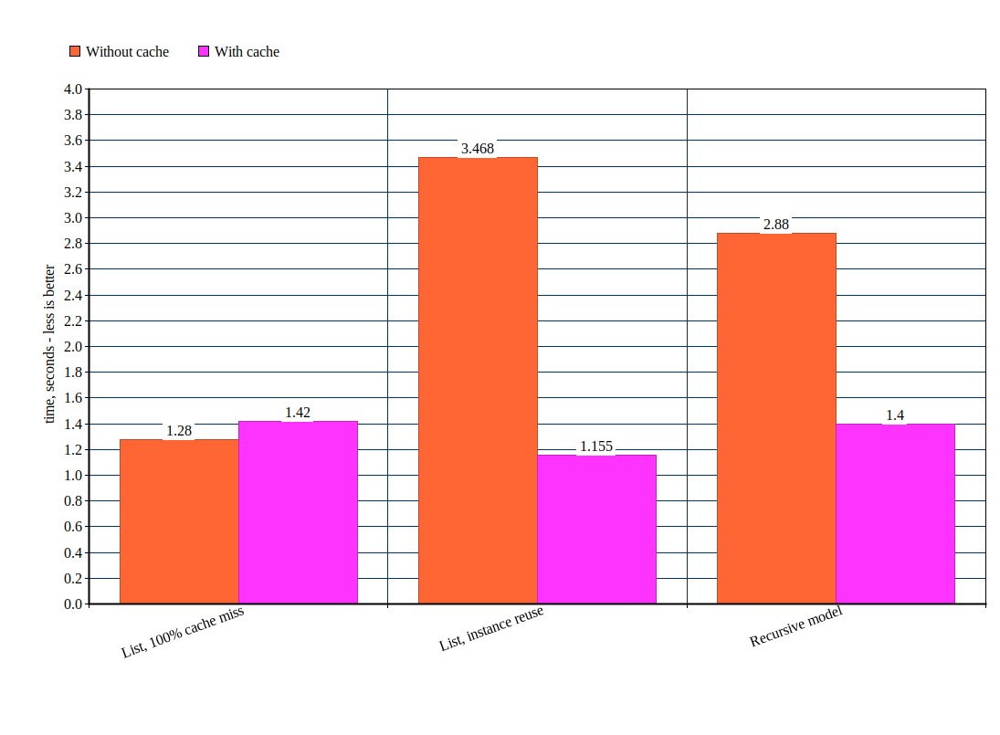

# Django REST framework serializers speedup

[](https://badge.fury.io/py/drf-serializer-cache)
[](https://travis-ci.org/K0Te/drf-serializer-cache)
[](https://coveralls.io/github/K0Te/drf-serializer-cache?branch=master)

Simple short-living cache implementation for DRF serializers.
It solves two issues with DRF serializers:
* `Serializer.fields` property can be extremely slow in some cases.
Such cases include complex `ModelSerializer`, serializer hierarchies
with repeated serializers and recursive serializers.
`fields` is cached and computed once per class for each serialization run.
This leads to limitation - `fields` should not be dynamically adjusted
inside of serializer, which inherits from `SerializerCacheMixin`;
* By default serializers will re-compute object representation event if
they encounter same object with same serializer twice. This can turn
into an issue, if multiple object include same dependent hard-to-serialize
objects. Cache avoid re-computing instance representation if it encounters
same instances multiple times.

## Performance results


## Cache life-time and invalidation
Cache is designed to be simple and non-error-prone.
Cache is created when top-level serializer `to_representation` starts
and is cleaned up once this method is finished. Thus there is no need
for timeouts or complex cache invalidation. No data is shared between
requests.
Thus, following cases will work fine:
```python
user = User.objects.get(name='Lee')
data_1 = UserSerializer(user).data
# OrderedDict([('name', 'Lee')])
user.name = 'Bob'
user.save()
data_2 = UserSerializer(user).data
# OrderedDict([('name', 'Bob')])
```

## Usage
Usage should be pretty simple - inject `SerializerCacheMixin` before
inheriting from `Serializer` or `ModelSerializer`:
```python
from drf_serializer_cache import SerializerCacheMixin
from rest_framework import serializers

class UserSerializer(SerializerCacheMixin, serializers.ModelSerializer):
    class Meta:
        model = User
        fields = ('id', 'name')
```

## Common pitfalls
#### Too often cache cleanup
Cache lives in serializer hierarchy root, but it's life-time is defined
by nearest tree node, which inherits from `SerializerCacheMixin`.
Ideal situation is when root inherits from `SerializerCacheMixin`.
That's why `SerializerCacheMixin` uses custom `list_serializer_class`,
which also inherits from `SerializerCacheMixin`.
If you use custom list as root of serializer hierarchy - it's recommended
to use `SerializerCacheMixin` as it's base class.
#### Too many hierarchies
By default serializers build nice hierarchy by calling `bind` on their
child serializers. This case can be broken for `serializers.SerializerMethodField`
if it uses some serializer without calling `bind` on it:
```python
from drf_serializer_cache import SerializerCacheMixin
from rest_framework import serializers

class ResultSerializer(SerializerCacheMixin, serializers.Serializer):
    results = serializers.SerializerMethodField()

    def get_results(self, instance):
        # recursive serializer
        serializer = self.__class__(instance.results, many=True)
        serializer.bind('*', self)  # bind call is essential for efficient cache !
        return serializer.data
```
